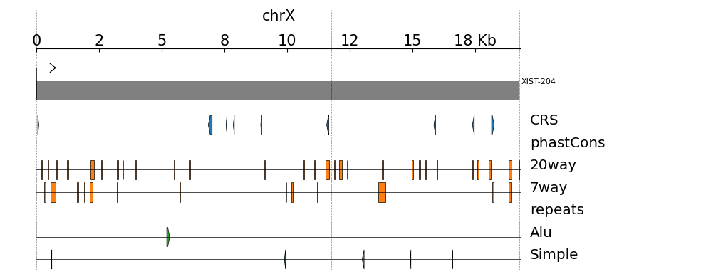

# ezTracks
[](https://doi.org/10.5281/zenodo.4749431)


`ezTracks` (*easy tracks*) plots a single GTF annotation followed by grouped bed files. `ezTracks` preprocesses the input tracks, allowing to change and render the plot without rebuilding indexes. It's smart enough to detect all beds inside folders, and also to omit tracks when they are not overlapping the queried region. Additionally, it generates annotations in **BED** and **CSV** format as well as an **XML IGV session** for further local inspection.

The core of this tool is [pyGenomeTracks](https://github.com/deeptools/pyGenomeTracks).

One advantage of `ezTracks` is the minimal effort to generate feature-oriented annotations and plots. For example, with a 17 line `ezTracks` configuration file one can automatically generate 150 lines of pyGenomeTracks' configuration and the corresponding annotation files. Additionally, one is not limited by the number of tracks/annotation BEDs plotted, as it usually occurs with genome browsers.

---
## Setup
The program it's just the file `eztracks.py` and the helper script  [reverseBed](https://github.com/HugoGuillen/reverseBed). It have been tested in Linux and Windows (Ubuntu WSL1). 

I suggest to setup a `conda` environment (Python 3.7+) for installing `ezTracks` dependencies:

```bash
conda config --add channels defaults
conda config --add channels bioconda
conda config --add channels conda-forge

conda create -n eztracks -c bioconda -c conda-forge -c anaconda nomkl pygenometracks bedtools freetype python=3.7
```

Make sure you *activate* the environment (`conda activate eztracks`) before running the script. If you are having problems *activating* the environment, adjust to your local anaconda installation:

```bash
source ~/anaconda3/etc/profile.d/conda.sh && conda activate eztracks
```

---
# Showcase
Data in `test_config/test_tracks` were obtained from the following references:

- Annotation: `Frankish, Adam, et al. "GENCODE reference annotation for the human and mouse genomes." Nucleic acids research 47.D1 (2019): D766-D773.`
- CRS: `Seemann, Stefan E., et al. "The identification and functional annotation of RNA structures conserved in vertebrates." Genome research 27.8 (2017): 1371-1383.`
- phastCons: `Siepel, Adam, et al. "Evolutionarily conserved elements in vertebrate, insect, worm, and yeast genomes." Genome research 15.8 (2005): 1034-1050.`
- repeats: `Smit, AFA, Hubley, R & Green, P. RepeatMasker Open-4.0. 2013-2015 <http://www.repeatmasker.org>.` and `Karolchik, Donna, et al. "The UCSC genome browser database." Nucleic acids research 31.1 (2003): 51-54.`.

With `ezTracks` you can generate three different views:

## Plot genomic region
Look for annotations overlapping genomic coordinates. This is specified in the field `region` in the `[default]` section of the configuration file.

Example at [test_config/config.region.ini](test_config/config.region.ini)


## Query individual transcripts
`ezTracks` will look for a transcript ID in your GTF file. This is specified in the field `transcript` in the `[default]` section of the configuration file.

*(Note: if `region` is also specified in the configuration, this mode won't work.)*

Example at [test_config/config.trans.ini](test_config/config.trans.ini)


## Transcript-relative annotation
One advantage of `ezTracks` over a regular genome browser is that you can easily get plots of the exonic regions of your transcript of interest. This is particularly usefull for long transcripts with low exonic content, such as lncRNAs. `ezTracks` will *force* the view to forward direction regardless of the transcript strand. `ezTracks` will look for a transcript ID in your GTF file. This is specified in the field `transcript` in the `[default]` section of the configuration file. Also, the option `no_introns` should be set to `yes`. 

*(Note: if `region` is also specified in the configuration, this mode won't work.)*

Example at 
Check [test_config/config.trans_relative.ini](test_config/config.trans_ni_ff.ini)



---
# Micro tutorial
## Introduction
`ezTracks` only needs a configuration file to work. The options implemented are the same as the sample file `test_config/config.*.ini`. To generate the first image shown above you just need to enter this directory and run: 

```bash
conda activate eztracks
python eztracks.py check test_config/config.region.ini
python eztracks.py prepare test_config/config.region.ini
python eztracks.py draw test_config/config.region.ini
```

The complete tutorial is located [here](tutorial.md). However, just keep in mind that the different modes are accessed via the configuration file in the `[default]` section.

---
# Output files
## Output image
Output image as specified in the field `output_img` in the `[plot]` section of the configuration file.

## `config.ini`

Configuration file for PyGenomeTracks. This is the file to modify if you want to fine tune your plot without rerunning the whole annotation. After modifying, you need to run the script `cmd_draw.sh`.

## `output.annotation.bed`

Annotation in BED6 format. `name` field (column 4) is coded as `DATASET</SUBDATASET>:FEATURE_NAME`, and `strand` field (column 6) has a `.` if the dataset didn't include strand information. For the transcript-relative mode, the `strand` is indicated as relative to the strand direction, not the forward strand.

## `output.annotation.csv`

Same information as `output.annotation.bed` but with `DATASET` and `FEATURE_NAME` split into two distinct columns.

## `output.igv.session.xml`

[The Integrative Genomics Viewer (IGV)](https://software.broadinstitute.org/software/igv/) is a high-performance, easy-to-use, interactive tool for the visual exploration of genomic data. You can load this file into your IGV local installation.

---
# TODO

- Update tutorial to cover all modes and explain parameters.
- Accept arguments via command line and override configuration file.
- Global configuration for PYGT template.

---
# About
Developed by Hugo Guillen, 2021.
