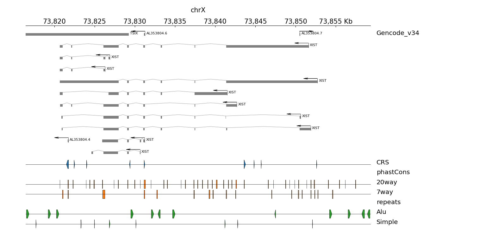

# ezTracks
`ezTracks` (*easy tracks*) is a pyGenomeTracks’s wrapper for plotting a single GTF annotation followed by grouped bed files. `ezTracks` preprocess the input tracks allowing to change and render the plot faster.

---
## Setup
The program it's just the file `eztracks.py` and works on Linux and Windows (Ubuntu WSL1) (I have not checked on Mac but it should work too). 

I suggest to setup a `conda` environment for installing `ezTracks` dependencies:

```bash
conda config --add channels defaults
conda config --add channels bioconda
conda config --add channels conda-forge

conda create -n eztracks --yes python=3
conda activate eztracks
conda install -c anaconda freetype
conda install -c bioconda bedtools
pip install git+https://github.com/deeptools/HiCMatrix.git
pip install git+https://github.com/deeptools/pyGenomeTracks.git
```

*Note*: if you are having problems activating the environment, probably you can replace the line 
```bash
conda activate eztracks
````
with
```bash
source ~/anaconda3/etc/profile.d/conda.sh && conda activate eztracks
```

---
# Micro tutorial
## Introduction
`ezTracks` only needs a configuration file to work. The only options implemented are the same as the sample file `test/test_config.ini`. The coordinates must be in bed format.

To process to generate a plot is:
1. Activate the `eztracks` environment (or having all dependencies available in the PATH)
2. Run `python eztracks.py check path/to/config_file`
3. Run `python eztracks.py prepare path/to/config_file`
4. Run `python eztracks.py prepare path/to/config_file`
5. Modify `output_path/config.ini` for cosmetic changes and rerun the `pyGenomeTracks` command.

## 1. Check the integrity of the test data
We are going to work with the test data provided in this repository (they are cropped to the region of interest of the configuration file, so you may want to try with your own data after finishing this tutorial). In your terminal enter this folder, and examine the configuration file:
```bash
> cat test/test_config.ini

[default]
chr = chrX
start = 73816524
end = 73859248
output_path = test_output
input_gtf = test/test_tracks/test.gtf

[tracks]
CRS = test/test_tracks/CRS.bed.gz
phastCons = test/test_tracks/phastcons
repeats = test/test_tracks/repeats

[plot]
output_img = my_tracks.pdf
gtf_title = Gencode_v34
gtf_height = 10
padding = -10000
width = 40
dpi = 100
```

Now, we are going to activate the environment and verify the config file and the input data:
```bash
> conda activate eztracks
> python eztracks.py check test/test_config.ini

# conda_env: /home/hugo/anaconda3/envs/eztracks: Python 3.8.3
# pyGenomeTracks 3.4
# bedtools v2.29.2
# config_file found at /home/hugo/software/ezTracks/test/test_config.ini
# Found CRS: test/test_tracks/CRS.bed.gz
# Found phastCons: test/test_tracks/phastcons
# Found phastCons-20way: test/test_tracks/phastcons/20way.bed.gz
# Found phastCons-7way: test/test_tracks/phastcons/7way.bed.gz
# Found repeats: test/test_tracks/repeats
# Found repeats-Alu: test/test_tracks/repeats/Alu.bed.gz
# Found repeats-Simple: test/test_tracks/repeats/Simple.bed.gz
# Checkup finalized. 0 error(s) detected.
```

## 2. Preprocess track files
If there were no errors in the last step, now we can preprocess the input tracks. Basically we will get only the portion we are interested to plot into the folder `output_path/prep`:


```bash
> python eztracks.py prepare test/test_config.ini

# Created dir /home/hugo/software/ezTracks/test_output
# Created dir /home/hugo/software/ezTracks/test_output/prep
# Wrote /home/hugo/software/ezTracks/test_output/prep/query.bed
# Created dir /home/hugo/software/ezTracks/test_output/prep/CRS
# Created dir /home/hugo/software/ezTracks/test_output/prep/phastCons
# Created dir /home/hugo/software/ezTracks/test_output/prep/repeats
intersectBed -sorted -u -a test/test_tracks/test.gtf -b /home/hugo/software/ezTracks/test_output/prep/query.bed | sort -k1,1 -k4,4n > /home/hugo/software/ezTracks/test_output/prep/input.gtf
intersectBed -sorted -u -a test/test_tracks/CRS.bed.gz -b /home/hugo/software/ezTracks/test_output/prep/query.bed > /home/hugo/software/ezTracks/test_output/prep/CRS/CRS.bed
intersectBed -sorted -u -a test/test_tracks/phastcons/20way.bed.gz -b /home/hugo/software/ezTracks/test_output/prep/query.bed > /home/hugo/software/ezTracks/test_output/prep/phastCons/20way.bed
intersectBed -sorted -u -a test/test_tracks/phastcons/7way.bed.gz -b /home/hugo/software/ezTracks/test_output/prep/query.bed > /home/hugo/software/ezTracks/test_output/prep/phastCons/7way.bed
intersectBed -sorted -u -a test/test_tracks/repeats/Alu.bed.gz -b /home/hugo/software/ezTracks/test_output/prep/query.bed > /home/hugo/software/ezTracks/test_output/prep/repeats/Alu.bed
intersectBed -sorted -u -a test/test_tracks/repeats/Simple.bed.gz -b /home/hugo/software/ezTracks/test_output/prep/query.bed > /home/hugo/software/ezTracks/test_output/prep/repeats/Simple.bed
# Done.
```

## 3. Plot the tracks


```bash
> python eztracks.py draw test/test_config.ini

INFO:pygenometracks.tracksClass:initialize 1. [x-axis]
INFO:pygenometracks.tracksClass:initialize 2. [test gtf]
100%|██████████████████████████████████████████████████████████| 14/14 [00:00<00:00, 2763.96it/s]
INFO:pygenometracks.tracksClass:initialize 3. [spacer]
INFO:pygenometracks.tracksClass:initialize 4. [test CRS-CRS]
100%|█████████████████████████████████████████████████████████| 29/29 [00:00<00:00, 30234.85it/s]
INFO:pygenometracks.tracksClass:initialize 5. [lspacer]
INFO:pygenometracks.tracksClass:initialize 6. [bedspacer phastCons]
0it [00:00, ?it/s]
WARNING:pygenometracks.tracks.GenomeTrack:No valid intervals were found in file /home/hugo/software/ezTracks/test_output/prep/empty.bed
INFO:pygenometracks.tracksClass:initialize 7. [test phastCons-20way]
100%|█████████████████████████████████████████████████████████| 80/80 [00:00<00:00, 36784.07it/s]
INFO:pygenometracks.tracksClass:initialize 8. [lspacer]
INFO:pygenometracks.tracksClass:initialize 9. [test phastCons-7way]
100%|█████████████████████████████████████████████████████████| 26/26 [00:00<00:00, 34997.40it/s]
INFO:pygenometracks.tracksClass:initialize 10. [lspacer]
INFO:pygenometracks.tracksClass:initialize 11. [bedspacer repeats]
0it [00:00, ?it/s]
WARNING:pygenometracks.tracks.GenomeTrack:No valid intervals were found in file /home/hugo/software/ezTracks/test_output/prep/empty.bed
INFO:pygenometracks.tracksClass:initialize 12. [test repeats-Alu]
100%|█████████████████████████████████████████████████████████| 15/15 [00:00<00:00, 24887.09it/s]
INFO:pygenometracks.tracksClass:initialize 13. [lspacer]
INFO:pygenometracks.tracksClass:initialize 14. [test repeats-Simple]
100%|███████████████████████████████████████████████████████████| 8/8 [00:00<00:00, 23967.45it/s]
INFO:pygenometracks.tracksClass:initialize 15. [lspacer]
INFO:pygenometracks.tracksClass:time initializing track(s):
INFO:pygenometracks.tracksClass:0.06300568580627441
DEBUG:pygenometracks.tracksClass:Figure size in cm is 40.0 x 19.015957446808514. Dpi is set to 100

INFO:pygenometracks.tracksClass:plotting 1. [x-axis]
INFO:pygenometracks.tracksClass:plotting 2. [test gtf]
DEBUG:pygenometracks.tracks.GenomeTrack:ylim 21.78,-0.08
INFO:pygenometracks.tracksClass:plotting 3. [spacer]
INFO:pygenometracks.tracksClass:plotting 4. [test CRS-CRS]
DEBUG:pygenometracks.tracks.GenomeTrack:ylim 2.3,-0.08
INFO:pygenometracks.tracksClass:plotting 5. [lspacer]
DEBUG:pygenometracks.tracks.GenomeTrack:y_values: [0.5]
DEBUG:pygenometracks.tracks.GenomeTrack:y_value: 0.5
INFO:pygenometracks.tracksClass:plotting 6. [bedspacer phastCons]
WARNING:pygenometracks.tracks.GenomeTrack:*Warning*
Neither chrX nor X existss as a chromosome name inside the bed file. This will generate an empty track!!

INFO:pygenometracks.tracksClass:plotting 7. [test phastCons-20way]
DEBUG:pygenometracks.tracks.GenomeTrack:ylim 2.3,-0.08
INFO:pygenometracks.tracksClass:plotting 8. [lspacer]
DEBUG:pygenometracks.tracks.GenomeTrack:y_values: [0.5]
DEBUG:pygenometracks.tracks.GenomeTrack:y_value: 0.5
INFO:pygenometracks.tracksClass:plotting 9. [test phastCons-7way]
DEBUG:pygenometracks.tracks.GenomeTrack:ylim 2.3,-0.08
INFO:pygenometracks.tracksClass:plotting 10. [lspacer]
DEBUG:pygenometracks.tracks.GenomeTrack:y_values: [0.5]
DEBUG:pygenometracks.tracks.GenomeTrack:y_value: 0.5
INFO:pygenometracks.tracksClass:plotting 11. [bedspacer repeats]
WARNING:pygenometracks.tracks.GenomeTrack:*Warning*
Neither chrX nor X existss as a chromosome name inside the bed file. This will generate an empty track!!

INFO:pygenometracks.tracksClass:plotting 12. [test repeats-Alu]
DEBUG:pygenometracks.tracks.GenomeTrack:ylim 2.3,-0.08
INFO:pygenometracks.tracksClass:plotting 13. [lspacer]
DEBUG:pygenometracks.tracks.GenomeTrack:y_values: [0.5]
DEBUG:pygenometracks.tracks.GenomeTrack:y_value: 0.5
INFO:pygenometracks.tracksClass:plotting 14. [test repeats-Simple]
DEBUG:pygenometracks.tracks.GenomeTrack:ylim 2.3,-0.08
INFO:pygenometracks.tracksClass:plotting 15. [lspacer]
DEBUG:pygenometracks.tracks.GenomeTrack:y_values: [0.5]
DEBUG:pygenometracks.tracks.GenomeTrack:y_value: 0.5
# Wrote /home/hugo/software/ezTracks/test_output/my_tracks.pdf
#######################################################################
### If you want to customize the image modify /home/hugo/software/ezTracks/test_output/config.ini and then rerun
pyGenomeTracks --tracks /home/hugo/software/ezTracks/test_output/config.ini --region chrX:73826524-73849248 --fontSize 12 --trackLabelFraction 0.2 --trackLabelHAlign left --width 40 --dpi 100 -o /home/hugo/software/ezTracks/test_output/my_tracks.pdf
#######################################################################
```

And now the plot is ready in `test_output/my_tracks.pdf`! As the terminal output indicates, you can modify `test_output/config.ini` and rerun the `pyGenomeTracks` command to redraw the plot. The possible parameters for this new configuration file are located at https://pygenometracks.readthedocs.io/en/latest/content/possible-parameters.html

