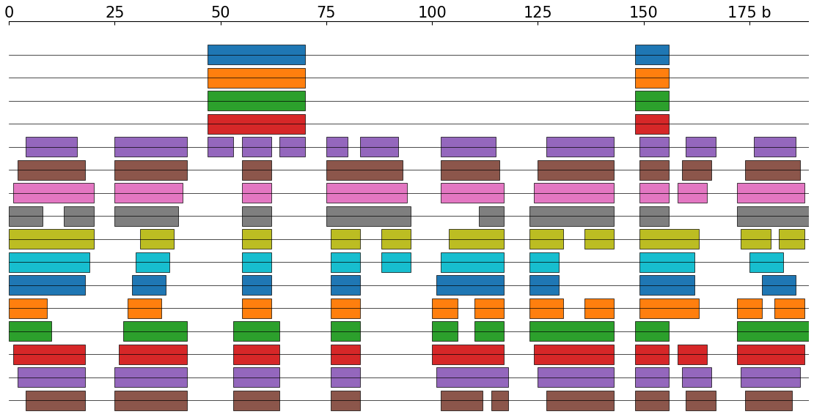
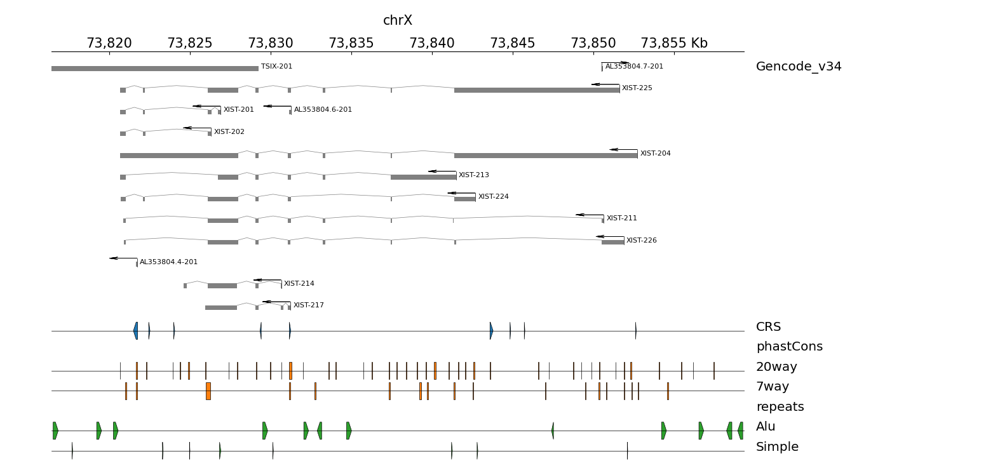
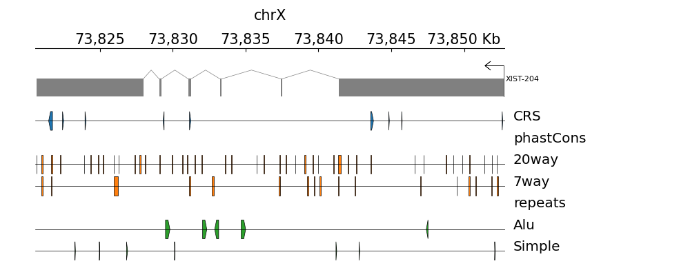
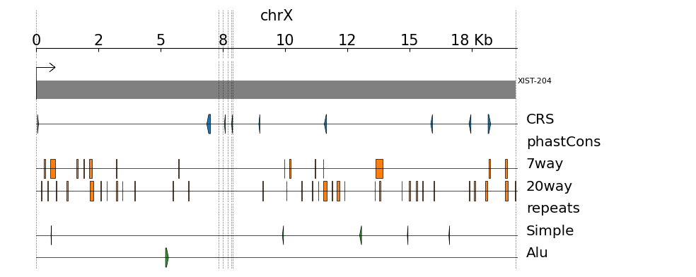
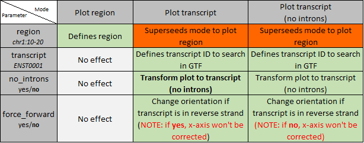

# ezTracks
`ezTracks` (*easy tracks*) plots a single GTF annotation followed by grouped bed files. `ezTracks` preprocesses the input tracks, allowing to change and render the plot faster. It's smart enough to detect all beds inside folders, and also to omit tracks when they result empty in the queried region.

The core of this tool is [pyGenomeTracks](https://github.com/deeptools/pyGenomeTracks).


With `ezTracks` you can generate three different views:

## Plot genomic region
Check [test/config.region.ini](test/config.region.ini)


## Query individual transcripts
Check [test/config.trans.ini](test/config.trans.ini)


## Transcript-relative annotation
Check [test/config.trans_ni_ff.ini](test/config.trans_ni_ff.ini)


---
## Setup
The program it's just the file `eztracks.py`. It works on Linux and Windows (Ubuntu WSL1) (I have not checked on Mac but it should work too). 

I suggest to setup a `conda` environment (Python 3.6+) for installing `ezTracks` dependencies:

```bash
conda config --add channels defaults
conda config --add channels bioconda
conda config --add channels conda-forge

conda create -n eztracks --yes python=3
conda activate eztracks
conda install -c anaconda freetype
conda install -c bioconda bedtools
pip install git+https://github.com/deeptools/HiCMatrix.git
pip install git+https://github.com/deeptools/pyGenomeTracks.git
```

*Note*: if you are having problems *activating* the environment, probably you can replace the line 
```bash
conda activate eztracks
````
with
```bash
source ~/anaconda3/etc/profile.d/conda.sh && conda activate eztracks
```

---
# Micro tutorial
## Introduction
`ezTracks` only needs a configuration file to work. The options implemented are the same as the sample file `test/config.*.ini`. To generate the first image shown above you just need to enter the `test` folder and run: 

```bash
conda activate eztracks
python eztracks.py check test/config.region.ini
python eztracks.py prepare test/config.region.ini
python eztracks.py draw test/config.region.ini
```

The complete tutorial is located [here](tutorial.md). However, just keep in mind that the different modes are accessed via the configuration file in the `[default]` section:


---
# TODO

- Update tutorial to cover all modes and explain parameters.
- Accept arguments via command line and override configuration file.
- Global configuration for PYGT template.